<!-- ══════════════════════════════════════════════════════════════ -->
<!--                     ANIMATED HEADER                          -->
<!-- ══════════════════════════════════════════════════════════════ -->

<div align="center">


</div>

<!-- ══════════════════════════════════════════════════════════════ -->
<!--                     TYPING ANIMATION                         -->
<!-- ══════════════════════════════════════════════════════════════ -->

<div align="center">

[](https://git.io/typing-svg)

</div>

---

<!-- ══════════════════════════════════════════════════════════════ -->
<!--                     ABOUT ME                                 -->
<!-- ══════════════════════════════════════════════════════════════ -->

## 🤖 `whoami`



```bash
$ cat about_me.yaml
```

```yaml
name:       Taweeporn Maneesin
role:       Robotics Software Engineer
location:   Thailand 🇹🇭
passion:    Building intelligent machines that interact with the real world

focus:
  - Robot Operating System (ROS / ROS2)
  - Motion Planning & Path Algorithms
  - Autonomous Navigation & Perception
  - Embedded & Real-time Systems
  - Robot Arm Kinematics & Control

currently:
  learning:  Advanced Manipulation & SLAM
  building:  Autonomous robotic systems
  exploring: Edge AI on embedded platforms
```

---

<!-- ══════════════════════════════════════════════════════════════ -->
<!--                     TECH STACK                               -->
<!-- ══════════════════════════════════════════════════════════════ -->

## ⚙️ Tech Stack & Tools

### 🦾 Robotics & Simulation


### 💻 Programming Languages


### 🤖 AI / ML & Perception


### 🔧 Embedded & Hardware


### 🛠️ Dev Tools & Platforms


---

<!-- ══════════════════════════════════════════════════════════════ -->
<!--                     GITHUB STATS                             -->
<!-- ══════════════════════════════════════════════════════════════ -->

## 📊 GitHub Analytics

<div align="center">

<!-- Top Languages (stable, works well) -->


<!-- Activity Graph -->
[](https://github.com/ashutosh00710/github-readme-activity-graph)

</div>

<div align="center">

<!-- Streak Stats -->
[](https://git.io/streak-stats)

</div>

---

<!-- ══════════════════════════════════════════════════════════════ -->
<!--                   ROBOTICS PHILOSOPHY                        -->
<!-- ══════════════════════════════════════════════════════════════ -->

## 🧠 Engineering Philosophy

> *"A robot that can't handle the unexpected is just an expensive conveyor belt."*

```
Sense ──▶ Plan ──▶ Act ──▶ Learn ──▶ repeat()
  🔭         🧠       🦾       📈
```

I believe in building robots that are **robust**, **adaptable**, and **safe** — systems that degrade gracefully under uncertainty and act reliably in the real world.

---

<!-- ══════════════════════════════════════════════════════════════ -->
<!--                     CONNECT                                  -->
<!-- ══════════════════════════════════════════════════════════════ -->

## 🌐 Let's Connect

<div align="center">

[](https://www.linkedin.com/in/taweeporn-maneesin-4052682b1/)
[](https://github.com/reaper1947)

</div>

<br/>

<div align="center">

> 🤝 Open to collaborations on robotics, autonomous systems, and embedded AI projects.
> 
> 📬 Feel free to reach out — let's build something that moves!

</div>

<!-- ══════════════════════════════════════════════════════════════ -->
<!--                     FOOTER WAVE                              -->
<!-- ══════════════════════════════════════════════════════════════ -->


<div align="center">
  
</div>
